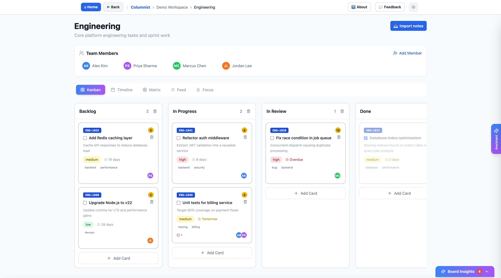
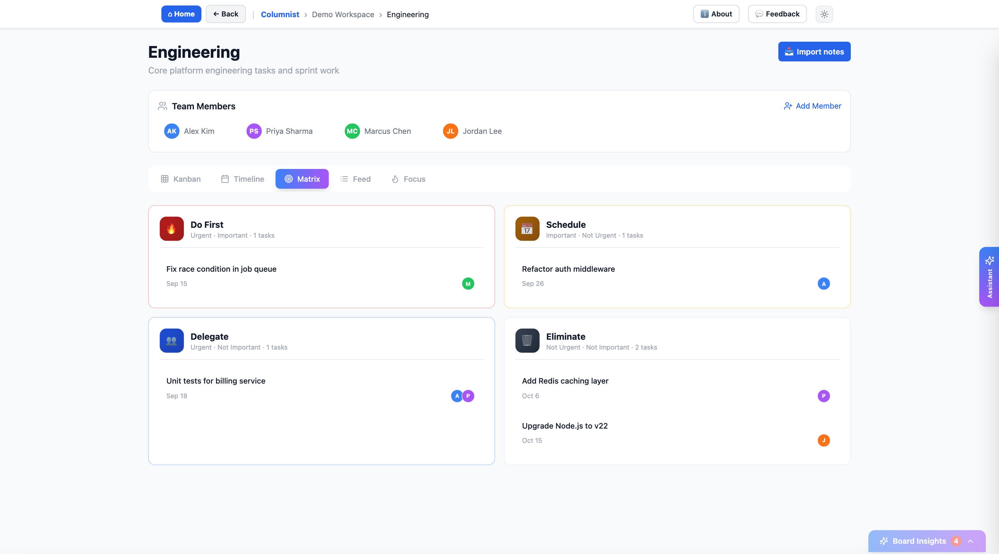

# Columnist

A kanban board with two AI agents built in. The **assistant** answers questions about your boards
the way a colleague would brief a manager: bottom line first, then the cards that matter, with
where they sit. The **notes-to-cards agent** reads a meeting note and proposes the cards it
implies, with owners, due dates and priorities, for you to approve one by one.

It is a complete, working application: five board views, workspaces, analytics, invite-only
accounts, and a React + FastAPI codebase with a backend suite of over 450 tests. It was deployed
on AWS for a month in 2026 and now runs locally. The AI features are alpha.

## What it looks like



The board, with the demo workspace loaded. Cards carry a key, a priority, a due date that turns red
when it is overdue, story points, labels and assignees; the same cards appear in four other views.



The same board as an Eisenhower matrix — urgency against importance, derived from each card's
priority and due date. Timeline, Feed and Focus are the other three.

## What it does

- **Boards** — workspaces, boards, columns and cards with priority, due dates, assignees, labels,
  story points, Jira-style keys and dependencies. Drag and drop.
- **Five views of the same cards** — Kanban, Timeline, Eisenhower Matrix, Feed and Focus.
- **The assistant** — ask "what's overdue?", "what's blocked?", "what's in Review?", then a
  follow-up like "and which of those are mine?". It reads only, it is limited to the workspace you
  are in, and it says so when it cannot answer rather than guessing.
- **Notes → cards** — paste or upload a note (`.txt` or `.docx`). Cards stream in as they are
  proposed, flagged when the agent is unsure, and nothing reaches the board until you approve it.
  Approving a batch can be undone.
- **Analytics** — workload per person, flow between columns, blocked and dependent cards.
- **Accounts** — invite-only sign-in through Amazon Cognito, with workspace sharing. Off by default
  when running locally.

## How it was built

Specifications, design decisions and evaluation criteria are the author's.
Implementation was produced by a coding agent, Claude Code, under direction.

How the agents were specified, guarded and evaluated shows up directly in the code:

- **Guardrails are structural, not just a prompt.** Every chat tool is a read-only query. A
  per-request allowlist of the caller's boards filters every query below the model, so a model
  that has been talked into something still reads nothing it shouldn't. The board being viewed is
  supplied by the server and never appears in a tool schema.
- **The model recommends; code writes.** The extraction model cannot create a card. It returns a
  proposal against a schema that has no fields for things it is not allowed to decide, and
  deterministic code applies it only after a person approves.
- **Language judgement goes to the model; arithmetic goes to code.** The model's reading of "by
  Friday" is corrected by a date resolver, because it got the weekday arithmetic wrong often
  enough to matter.
- **The quality bar was fixed before any model was tried.** Extraction had to reach 90% precision
  and 80% recall on labelled notes. Of three models measured on Amazon Bedrock, two failed.
  Claude Sonnet 4.5 cleared the bar on the labelled meeting transcripts it was measured on (July
  2026). That aggregate was measured on a labelled corpus that is **not** published: it is kept
  private as a regression set. What ships in [`agent_test_suite/`](agent_test_suite/) is the method
  — the model-free scorers, the runner, the label format, and one labelled example of each kind —
  so you can inspect how the number is produced and reproduce a score on those examples against
  whichever model you configure. The aggregate itself you have to take as measured, not reproduce.

## Run it

Requires **Node.js 20.19+** (or 22.12+) and **Python 3.11+**.

```bash
git clone <this repository>
cd columnist
npm install
bash scripts/dev-up.sh
```

`dev-up.sh` creates the backend virtualenv, installs its requirements, copies
`backend/.env.example` to `backend/.env` on first run, and starts the backend on port 8000 and the
frontend on port 5173. Open **http://localhost:5173** (not `127.0.0.1`, which Vite refuses) and
click **Load Demo Workspace**.

The defaults run with no cloud services at all: SQLite, no sign-in, and the AI agents switched
off. Everything but the two agents works in that mode; to switch them on, see
[Turning on the AI agents](#turning-on-the-ai-agents) below.

### API

Interactive API docs are at http://127.0.0.1:8000/docs. The frontend proxies `/api/v1` to the
backend in development.

## Stack

| | |
|---|---|
| Frontend | React 18, TypeScript, Vite, Tailwind CSS |
| Backend | FastAPI, Pydantic v2, plain SQL (no ORM) |
| Database | SQLite locally; PostgreSQL through the same code when `DATABASE_URL` is set |
| AI | Amazon Bedrock (Converse API), the OpenAI API or the Anthropic API, chosen by one setting; a bounded tool-calling loop for chat, structured extraction for notes |
| Auth | Amazon Cognito behind a backend-for-frontend: tokens live in httpOnly cookies, never in JavaScript |

Board edits are written as whole-board snapshots guarded by a server-side version number, and
column moves are recorded as events that feed the flow analytics. Diagrams are in
[`docs/design/architecture.md`](docs/design/architecture.md); the documentation index is
[`docs/README.md`](docs/README.md).

```text
src/                React app: components/ (board, chat, workspace, auth, …), api/, auth/
backend/app/        FastAPI app
  agents/           the chat agent: tools, bounded loop, providers (Bedrock, OpenAI, Anthropic), answer scorer
  note_imports/     the notes-to-cards agent: reader, prompt, schema, resolver, provider, scorer
backend/migrations/ SQL migrations, applied on startup
backend/tests/      the test suite
agent_test_suite/   representative labelled notes for the extraction eval
scripts/            dev bring-up, tests, evals
deploy/             the AWS scripts it was deployed with (ECS, RDS, CloudFront, Cognito)
```

To deploy your own copy on AWS, follow [`docs/DEPLOY.md`](docs/DEPLOY.md), or let
`deploy/bring-up.sh` run it for you. Every account-specific value is a variable you set once.

## Turning on the AI agents

Both agents, chat and notes-to-cards, use one model backend, chosen by `AGENT_BACKEND` in
`backend/.env`. The backend reads that file once at startup, so **restart `scripts/dev-up.sh` after
every change to it.**

| `AGENT_BACKEND` | What you need | Default model | Measured against the quality bar |
|---|---|---|---|
| `openai` | an OpenAI API key | `gpt-4.1-mini` (`OPENAI_MODEL`) | chat: yes; notes-to-cards: no, fails a third of the gating notes ([September 2026](agent_test_suite/README.md#results-on-gpt-41-mini-openai-2026-09-14)) |
| `anthropic` | an Anthropic API key | `claude-sonnet-4-5` (`ANTHROPIC_MODEL`) | no; tested against a fake client only |
| `bedrock` | an AWS account with Bedrock access | Claude Sonnet 4.5 (`BEDROCK_MODEL_ID`) | yes, July 2026 |
| `offline` (the default) | nothing | none: both agents are off | n/a |

Quality is a property of the model, not of the code: a result measured on one model says nothing
about another. Every call is billed to your own account, and locally there is no daily token cap
(the per-user meter runs only when sign-in is configured).

### OpenAI

```bash
AGENT_BACKEND=openai
OPENAI_API_KEY=sk-...          # platform.openai.com → API keys
OPENAI_MODEL=gpt-4.1-mini      # optional; any Chat Completions model with tool calling
```

The agents send a fixed low `temperature` for reproducible results, so a model that does not accept
a `temperature` setting returns an error on every call.

### Anthropic

```bash
AGENT_BACKEND=anthropic
ANTHROPIC_API_KEY=sk-ant-...   # console.anthropic.com → API keys
ANTHROPIC_MODEL=claude-sonnet-4-5
```

This is the model the Bedrock results were measured on, called through Anthropic's own API. The
integration is covered by tests against a fake client and has not been run against the live API.
Newer Claude models reject the `temperature` parameter the agents send, so pointing
`ANTHROPIC_MODEL` at one needs a code change.

### Amazon Bedrock

Work through these in order; each step says how to check it before you move on.

1. **Pick a region.** The model ID in the template, `us.anthropic.claude-sonnet-4-5-20250929-v1:0`,
   is a US cross-region inference profile, so use a US region: `us-east-1`, `us-east-2` or
   `us-west-2`.
2. **Get model access.** In the Amazon Bedrock console, in that region, open Claude Sonnet 4.5 in
   the model catalog and confirm your account can use it. Anthropic models ask for a one-time
   use-case form per account the first time.
3. **Grant permissions.** The identity you run as needs `bedrock:InvokeModel` (which authorizes
   Converse) and `bedrock:InvokeModelWithResponseStream` (which authorizes ConverseStream), on both
   the inference profile and the foundation model it routes to. A minimal IAM policy, with your
   12-digit account ID in place of `<account-id>`:

   ```json
   {
     "Version": "2012-10-17",
     "Statement": [{
       "Effect": "Allow",
       "Action": ["bedrock:InvokeModel", "bedrock:InvokeModelWithResponseStream"],
       "Resource": [
         "arn:aws:bedrock:*:<account-id>:inference-profile/us.anthropic.claude-sonnet-4-5-20250929-v1:0",
         "arn:aws:bedrock:*::foundation-model/anthropic.claude-sonnet-4-5-20250929-v1:0"
       ]
     }]
   }
   ```

   The `*` region in both ARNs matters: the profile routes requests to several US regions.
4. **Provide credentials in the shell that starts the app, not in `backend/.env`.** The app reads
   `backend/.env` into its own settings without exporting anything to the environment, so AWS
   variables written there never reach the AWS SDK. Use one of:

   ```bash
   # a) access keys for an IAM user
   export AWS_ACCESS_KEY_ID=AKIA...
   export AWS_SECRET_ACCESS_KEY=...

   # b) a named profile from ~/.aws/credentials or ~/.aws/config
   export AWS_PROFILE=my-profile

   # c) a short-lived sign-in: `aws login`, or for IAM Identity Center:
   aws sso login --profile my-profile && export AWS_PROFILE=my-profile
   ```

   Check it: `aws sts get-caller-identity` prints the account and identity you will run as. A
   short-lived session expires; sign in again and restart the app when it does.
5. **Configure the app** in `backend/.env`:

   ```bash
   AGENT_BACKEND=bedrock
   BEDROCK_MODEL_ID=us.anthropic.claude-sonnet-4-5-20250929-v1:0   # already set in the template
   BEDROCK_REGION=us-east-1                                        # the region from step 1
   ```

   Set the region here, as `BEDROCK_REGION`. `AWS_REGION` in `backend/.env` is ignored, and the
   AWS SDK for Python does not read `AWS_REGION` from the shell either (it reads
   `AWS_DEFAULT_REGION`). Keep the model pinned: the code's fallback default is a cheaper model
   that failed the extraction quality bar, and falling back to it degrades results without any
   error.
6. **Check Bedrock before starting the app**, from the same shell:

   ```bash
   bash scripts/bedrock-probe.sh --region us-east-1 probe --model us.anthropic.claude-sonnet-4-5-20250929-v1:0
   ```

   It runs a small extraction against the model and prints the raw AWS error if anything above is
   wrong. It never changes anything in your account.
7. **Start the app** from the same shell:

   ```bash
   export AWS_EC2_METADATA_DISABLED=true   # missing or expired credentials fail at once instead of hanging
   bash scripts/dev-up.sh
   ```

If it still fails, the chat panel says only that it couldn't reach the assistant. The probe in
step 6 shows the underlying error; so does importing a note with `BEDROCK_DEBUG=1` exported before
step 7, which prints it in the backend's terminal.

| What you see | Cause | Fix |
|---|---|---|
| An error saying credentials could not be located | credentials are in `backend/.env`, or were exported in a different shell | step 4, in the shell that runs `dev-up.sh` |
| Chat waits, then gives up | no usable credentials, and the SDK is waiting on the EC2 metadata endpoint | step 7's `export`, then step 4 |
| An error mentioning an expired or invalid token | the sign-in session from step 4 ended | sign in again, restart the app |
| `AccessDeniedException` naming `bedrock:InvokeModel` | the step 3 policy is missing or names another model | fix the policy |
| `AccessDeniedException` about access to the model | step 2 is not done | request model access in the console |
| `ValidationException` about on-demand throughput | `BEDROCK_MODEL_ID` is the bare model ID, not the `us.` inference profile | use the ID from step 5 |
| `ValidationException` about the model identifier | `BEDROCK_REGION` is outside the profile's US regions | use a region from step 1 |

## Development

```bash
bash scripts/test.sh     # backend suite — fast, free, never calls a model
npm run typecheck
npm run build
```

See [`CONTRIBUTING.md`](CONTRIBUTING.md) for commit sign-off and the handful of things that are
easy to break.

## Security

This is a portfolio project, not a hardened product. Read [`SECURITY.md`](SECURITY.md) before
running it anywhere but your own machine. In particular, **never expose the MCP server
(`backend/app/mcp_server.py`) on a network**: it reads every board in the database, with no
authentication.

## License

Apache-2.0 — see [`LICENSE`](LICENSE) and [`NOTICE`](NOTICE).
