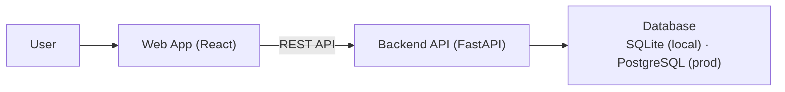
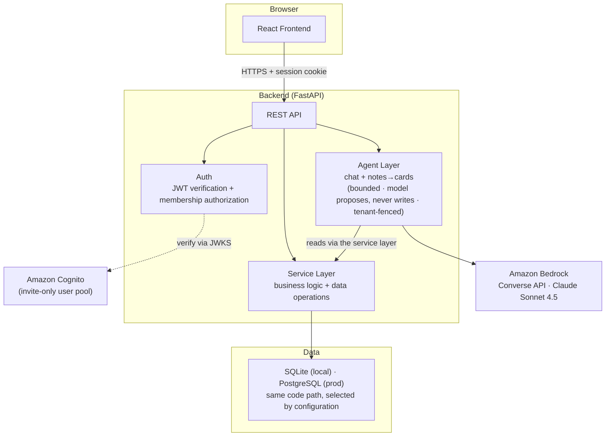
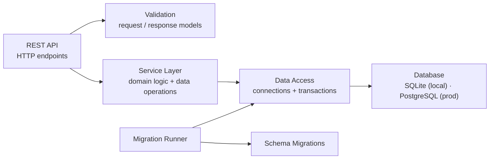
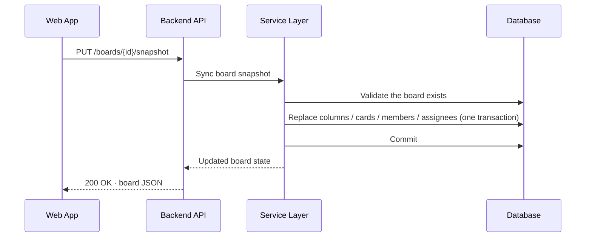
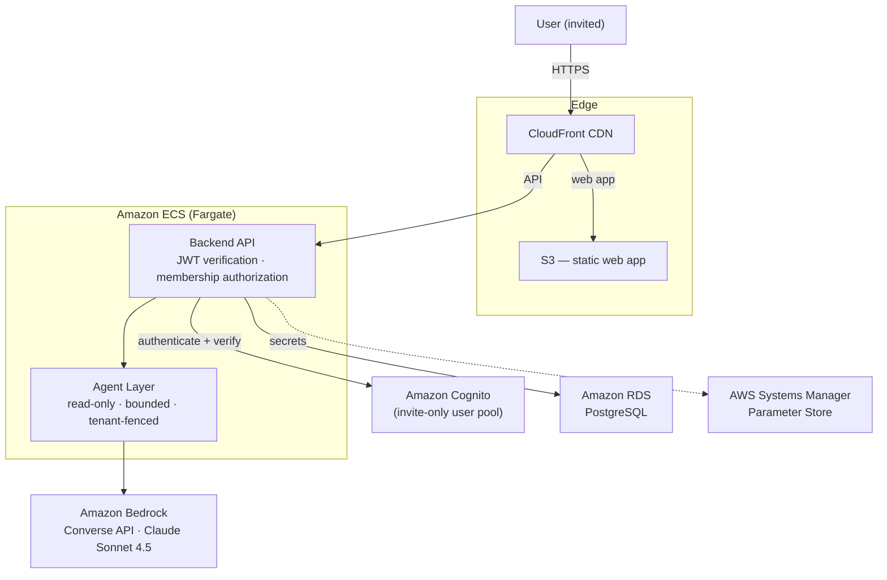

<!-- Rendered verbatim in the app's About → Architecture page; this file is the source for it. -->
# Columnist — Architecture

Columnist is a kanban board application with a guarded, read-only AI chat assistant and a
notes-to-cards agent. This document describes the system architecture across the standard C4 levels
and the AWS deployment it ran on.

## C4 Level 1: System Context

## C4 Level 2: Container Diagram

## C4 Level 3: Backend Components

## C4 Level 4: Key Runtime Flow (Board Edit)

## Production Architecture (AWS)

> **As deployed in 2026 (since torn down).** Same-origin, authenticated, with the load balancer reachable only through
> the CDN. The compute layer is **Amazon ECS Express Mode on Fargate**, which provisions the load
> balancer, autoscaling, HTTPS, and a public URL.

### Deployment notes

- **Compute:** Amazon ECS Express Mode on Fargate provisions the load balancer, autoscaling, HTTPS, and a public URL.
- **Auth:** Amazon Cognito user pool with self-signup disabled — an invitation creates the account. The backend verifies JSON Web Tokens against Cognito; authorization is membership-based (workspace owner / member).
- **AI:** the chat assistant and notes-to-cards agent run on **Amazon Bedrock** (Converse API, Claude Sonnet 4.5). The chat assistant is read-only; the notes-to-cards model only proposes, and cards are written by deterministic code after a person approves. Both are bounded and tenant-fenced. Outside AWS, the same agents can run on the OpenAI or Anthropic API instead, selected by `AGENT_BACKEND`.
- **Database:** Amazon RDS PostgreSQL when deployed; SQLite for local development, over the same code path.
- **Secrets:** AWS Systems Manager Parameter Store, injected at startup — no static keys in production.
- **Cost guards:** small per-workspace user and collaborator caps, and a monthly budget alarm.
- **Known limitation:** the write path uses whole-board snapshot synchronization, guarded by a server-side board version (a snapshot based on a stale version is rejected with HTTP 409 rather than overwriting newer changes); real-time concurrent editing is a future enhancement.
